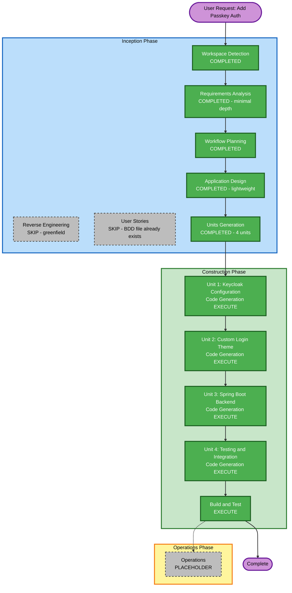

# Execution Plan — Autenticación Passwordless con Passkey en LifeMiles

## Detailed Analysis Summary

### Transformation Scope
- **Type**: Greenfield — new Spring Boot module and Keycloak-side artifacts (console guide, theme, fixture realm). No existing application code found in workspace.
- **Primary Changes**: New authentication method (Passkey/WebAuthn) integrated with an existing, separately-managed Keycloak deployment.
- **Related Components**: Keycloak (external, not managed by this codebase), FreeMarker login theme, Spring Boot backend, Account Console customization.

### Change Impact Assessment
- **User-facing changes**: Yes — new "Iniciar sesión con Passkey" option on login, new Passkey management panel.
- **Structural changes**: Yes — new Spring Boot module with package-based separation (`config`, `controller`, `service`, `model`, `security`, `exception`, `audit`).
- **Data model changes**: Minimal — Passkey metadata stored via Keycloak credential attributes, not a new database.
- **API changes**: Yes — new REST endpoints under `/api/v1/passkeys/**`.
- **NFR impact**: Yes — security (15 baseline rules), native image readiness, accessibility, performance targets.

### Risk Assessment
- **Risk Level**: Medium-High — authentication is security-critical; native image compatibility with Keycloak Admin Client is an open technical risk (flagged in Background); coexistence with existing auth methods must not regress.
- **Rollback Complexity**: Moderate — Passkey is additive (ALTERNATIVE execution in Browser flow), so disabling it in Keycloak console reverts to prior behavior without code rollback.
- **Testing Complexity**: Complex — 4 test layers (unit, integration/Testcontainers, E2E/Playwright+WebAuthn, BDD/Cucumber) plus PBT.

## Workflow Visualization



### Text Alternative

```
INCEPTION PHASE
- Workspace Detection: COMPLETED (greenfield)
- Reverse Engineering: SKIPPED (greenfield, no existing code)
- Requirements Analysis: COMPLETED (minimal depth, pre-existing artifacts)
- User Stories: SKIPPED (bdd-passkey-lifemiles.md already covers this)
- Workflow Planning: COMPLETED (this document)
- Application Design: COMPLETED (lightweight, package structure pre-defined)
- Units Generation: COMPLETED (4 units)

CONSTRUCTION PHASE
- Unit 1: Keycloak Configuration - EXECUTE
- Unit 2: Custom Login Theme - EXECUTE
- Unit 3: Spring Boot Backend - EXECUTE
- Unit 4: Testing and Integration - EXECUTE
- Build and Test - EXECUTE

OPERATIONS PHASE
- Operations: PLACEHOLDER
```

## Phases to Execute

### Inception Phase
- [x] Workspace Detection (COMPLETED)
- [x] Reverse Engineering (SKIPPED — greenfield)
- [x] Requirements Analysis (COMPLETED — minimal depth, since scope/decisions were already fully negotiated in conversation and prior artifacts)
- [x] User Stories (SKIPPED — `bdd-passkey-lifemiles.md` already provides equivalent Gherkin coverage and a requirements traceability table)
- [x] Workflow Planning (COMPLETED — this document)
- [x] Application Design (EXECUTE — lightweight; needed to confirm package/service boundaries map cleanly onto units, but the implementation plan had already defined most of this per-task)
- [x] Units Generation (EXECUTE — needed to formally group the 10 tasks into buildable, dependency-ordered units)

### Construction Phase
- [ ] Unit 1: Keycloak Configuration — Code Generation EXECUTE (ALWAYS)
  - **Rationale**: Foundational; all other units depend on it
- [ ] Unit 2: Custom Login Theme — Code Generation EXECUTE (ALWAYS)
  - **Rationale**: User-facing Passkey entry points required
- [ ] Unit 3: Spring Boot Backend — Code Generation EXECUTE (ALWAYS)
  - **Rationale**: Core business logic, security, and API surface
- [ ] Unit 4: Testing & Integration — Code Generation EXECUTE (ALWAYS)
  - **Rationale**: Comprehensive automated verification explicitly required (BDD, E2E, PBT)
- [ ] Build and Test — EXECUTE (ALWAYS)
  - **Rationale**: Final build/test instructions across all units

**Per-unit design stages (Functional Design, NFR Requirements, NFR Design, Infrastructure Design) are SKIPPED for all units**: the implementation plan already specifies, per task, the exact business logic, security compliance mapping, tech stack, and infrastructure (Dockerfiles, native profile) needed. Re-deriving these through separate design stages would duplicate content already approved by the user. Design decisions are embedded directly in each unit's code generation plan.

### Operations Phase
- [ ] Operations — PLACEHOLDER

## Package/Unit Update Sequence

1. **Unit 1: Keycloak Configuration** — no dependencies, unblocks everything else
2. **Unit 2: Custom Login Theme** — depends on Unit 1 (flow/theme wiring)
3. **Unit 3: Spring Boot Backend** — depends on Unit 1 (Keycloak connectivity contract)
4. **Unit 4: Testing & Integration** — depends on Units 1-3 (exercises the full stack)

## Estimated Timeline

- **Total Units**: 4 (10 tasks)
- **Estimated Duration**: Multi-session effort given the scope (full-stack auth feature + native image + 4 test layers); each unit executed as its own Code Generation Planning → Generation cycle with checkpoints.

## Success Criteria

- **Primary Goal**: Passkey available as a coexisting, secure, accessible third authentication method in LifeMiles.
- **Key Deliverables**: Keycloak console guide + test fixture realm, FreeMarker theme, Spring Boot backend (native-ready), full BDD/E2E/PBT test automation, native image + deployment docs.
- **Quality Gates**: All 15 Security Baseline rules compliant (blocking), PBT Partial rules (02/03/07/08/09) compliant (blocking), all BDD scenarios automated, native image builds and starts successfully.
